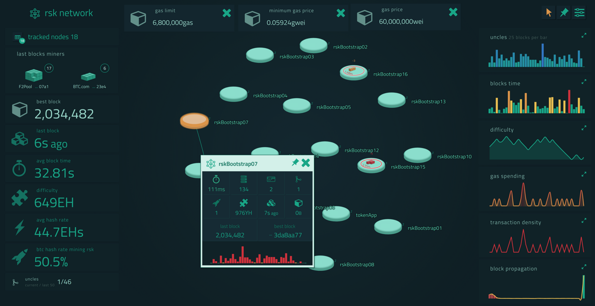

# RSK Stats

> Rsk network stats web client



## Tasks

``` bash
# install dependencies
npm install

# serve with hot reload
npm run dev

# build for production
npm run build

```

## Build settings

Backend url:

``` bash

  export WS_URL=ws://[backend-url]
  npm run build
```

## Icons

- Copy SVG files on : static/svg/icons
- Compile SVG

 ``` bash

  npm run svg

```

## Configuration

scr/config:

- **charts.js**
- **colors.json**
- **entities.js**
- **entityValues.js**
- **media_breakpoints.json**: media queries
- **miners.json**: miners names list.
- **table.js**: nodes table configuration.
- **thresholds.js**
